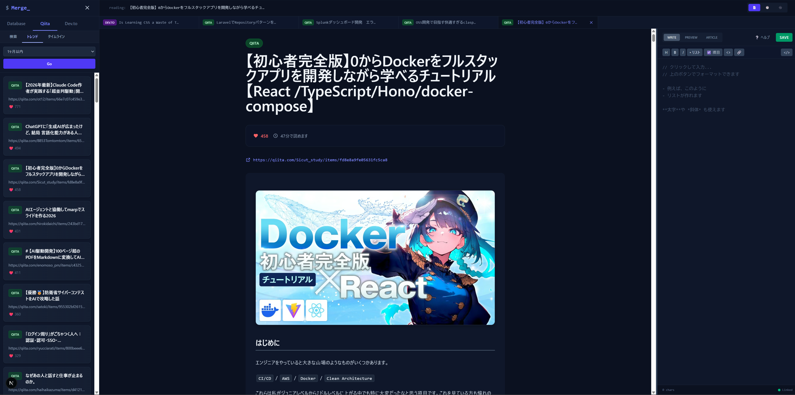

# Merge_

> **記事と知見を、ひとつにマージする。**
>
> Merge は、技術記事（Qiita / Dev.to / 保存済みDB）を読む・比較する・メモするを 1 画面で完結させる、ローカル実行前提のナレッジ管理アプリです。

## 📸 UI



## ✨ Features

- **記事ソース切り替え**: Database / Qiita / Dev.to を左サイドバーから切り替え
- **検索 / トレンド / タイムライン**: Qiita・Dev.to はサブタブで切り替え、期間/並び替えも指定可能
- **タブ閲覧**: 記事をタブで開いて切り替え（上限あり）
- **比較表示（Split View）**: 2 本の記事を左右に並べて比較
- **履歴ビュー**: 最近開いた記事の履歴を表示（ブラウザ保存）
- **グラフビュー**: 閲覧中/履歴の関係をネットワークで可視化
- **メモ**: Markdown で記録し、記事ごとに復元。DBに保存
- **埋め込み表示**: Qiita の埋め込み（Twitter / link card 等）を表示できる形に変換

## 🧱 Architecture

- Frontend: Next.js（開発サーバ）
- Backend: Spring Boot（REST API）
- DB: PostgreSQL（docker-compose）
- Optional: pgAdmin（docker-compose）

## 🛠 Tech Stack

- Frontend: Next.js / React / TypeScript / Tailwind CSS / highlight.js / react-markdown
- Backend: Spring Boot / Java 25 / Spring Data JPA
- Infra: Docker Compose / PostgreSQL

## 🚀 Getting Started

### Prerequisites

- Docker
- Node.js（フロント開発用）

### 1) 環境変数を用意

`.env.example` を `.env` にコピーして編集します（トークンは任意）。

### 2) Backend + DB を起動（Docker）

```bash
docker compose up --build -d
```

- Backend: http://localhost:8080
- pgAdmin: http://localhost:8081
- PostgreSQL: localhost:5432

### 3) Frontend を起動（ローカル）

別ターミナルで:

```bash
cd merge-frontend
npm install
npm run dev
```

Frontend: http://localhost:3000

## 🔌 API（Backend）

フロントは主に以下を利用します。

- `GET /api/articles`（DB記事一覧）
- `GET /api/articles/search`（DB記事検索）
- `GET /api/qiita/search|hot|timeline|article/{id}`
- `GET /api/dev/search|hot|timeline|article/{id}`
- `GET /api/memos/search?url=...`（URLからメモ取得）
- `POST /api/memos`（メモ保存）

## Notes

- `.env` には個人トークンが入るため、コミットしないでください。
- DBデータは `infra/postgres/data` に永続化されます。
