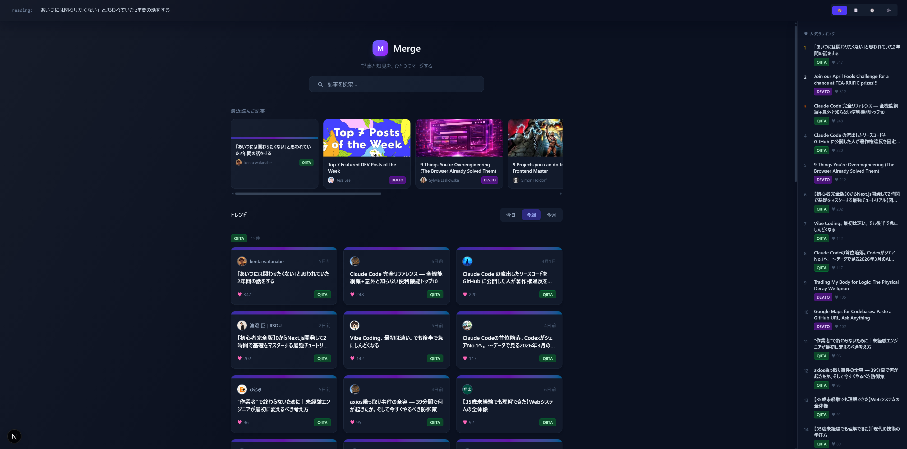
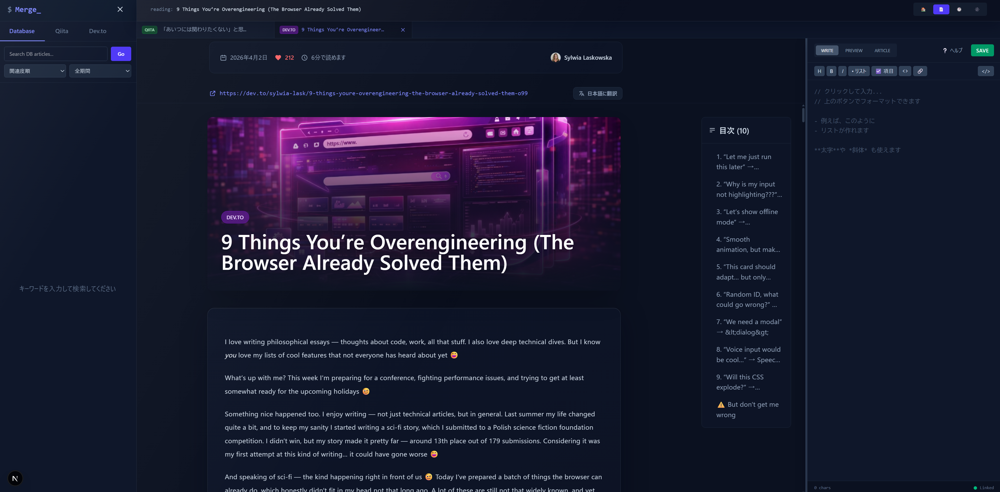
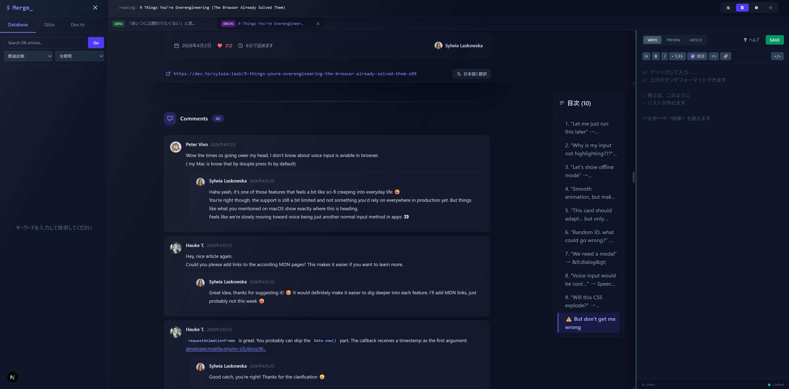
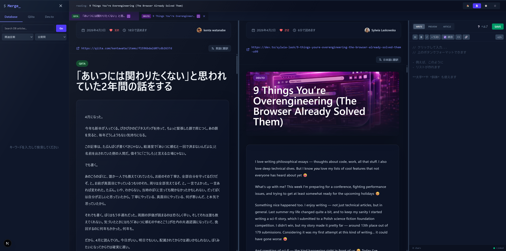
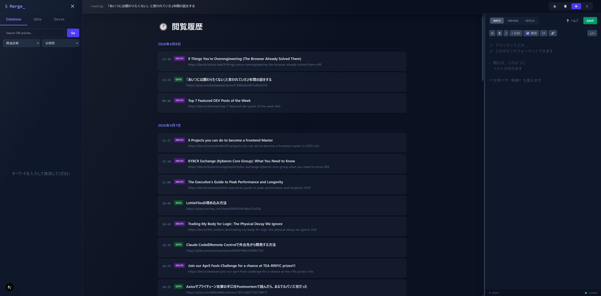

# Merge_

> **記事と知見を、ひとつにマージする。**
>
> Merge は、技術記事（Qiita / Dev.to / 保存済みDB）を読む・比較する・メモするを 1 画面で完結させる、ローカル実行前提のナレッジ管理アプリです。

## 📸 UI

### ホーム


### 記事閲覧 / メモ / 目次


### コメント表示


### 分割表示（Split View）


### 閲覧履歴


## ✨ Features

- **ホーム画面**: グローバル検索・最近読んだ記事カルーセル・トレンド一覧・人気ランキングを一望
- **記事ソース切り替え**: Database / Qiita / Dev.to を左サイドバーから切り替え
- **検索 / トレンド / タイムライン**: Qiita・Dev.to はサブタブで切り替え、期間/並び替えも指定可能
- **タブ閲覧**: 記事をタブで開いて切り替え（上限あり）
- **比較表示（Split View）**: 2 本の記事を左右に並べて比較
- **翻訳**: Qiita 記事 → 英語、Dev.to 記事 → 日本語へワンクリック翻訳（本文・タイトル・コメントをまとめて翻訳）
- **コメント表示**: Qiita / Dev.to のコメントスレッドをそのまま閲覧
- **目次（ToC）**: 記事の見出しから自動生成、クリックでジャンプ
- **ユーザー記事一覧**: 著者アバターをクリックしてユーザーの記事一覧に遷移
- **履歴ビュー**: 最近開いた記事の履歴を日付別に表示（ブラウザ保存）
- **グラフビュー**: 閲覧中/履歴の関係をネットワークで可視化
- **メモ**: Markdown で記録し、記事ごとに復元。DB に保存（WRITE / PREVIEW / ARTICLE の 3ペイン）
- **埋め込み表示**: Qiita の埋め込み（Twitter / link card 等）を表示できる形に変換

## 🧱 Architecture

- Frontend: Next.js（開発サーバ）
- Backend: Spring Boot（REST API）
- DB: PostgreSQL（docker-compose）
- Optional: pgAdmin（docker-compose）

## 🛠 Tech Stack

- Frontend: Next.js / React / TypeScript / Tailwind CSS / highlight.js / react-markdown
- Backend: Spring Boot 4 / Java 25 / Spring Data JPA
- Infra: Docker Compose / PostgreSQL

## 🚀 Getting Started

### Prerequisites

- Docker
- Node.js（フロント開発用）

### 1) 環境変数を用意

`.env.example` を `.env` にコピーして編集します（トークンは任意）。

### 2) Backend + DB を起動（Docker）

```bash
docker compose up --build -d
```

- Backend: http://localhost:8080
- pgAdmin: http://localhost:8081
- PostgreSQL: localhost:5432

### 3) Frontend を起動（ローカル）

別ターミナルで:

```bash
cd merge-frontend
npm install
npm run dev
```

Frontend: http://localhost:3000

## 🔌 API（Backend）

フロントは主に以下を利用します。

**DB記事**
- `GET /api/articles` — 一覧
- `GET /api/articles/search` — 検索
- `GET /api/articles/by-url?url=...` — URL で記事取得
- `POST /api/articles` — 保存
- `DELETE /api/articles/{id}` — 削除

**Qiita**
- `GET /api/qiita/search|hot|timeline`
- `GET /api/qiita/article/{id}`
- `GET /api/qiita/article/{id}/comments`
- `GET /api/qiita/user/{userId}/articles`

**Dev.to**
- `GET /api/dev/search|hot|timeline`
- `GET /api/dev/article/{id}`
- `GET /api/dev/article/{id}/comments`
- `GET /api/dev/user/{username}/articles`

**メモ**
- `GET /api/memos/search?url=...` — URL からメモ取得
- `POST /api/memos` — 保存

**翻訳**
- `POST /api/translate` — 記事本文・コメントの翻訳

## Notes

- `.env` には個人トークンが入るため、コミットしないでください。
- DBデータは `infra/postgres/data` に永続化されます。
